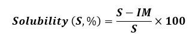

<b>Requirements (Instruments, Chemicals & Other) : </b>  

1.	Protein powder  
2.	Analytical Balance  
3.	Conical flask  
4.	Petri-dish  
5.	Whatman filter paper  
6.	Convective hot air oven  
7.	Shaker  
8.	Buffer solution  
9.	Measuring cylinder  
10.	Distilled water   

<b>Procedure : </b> 

1.	Weigh 10g protein powder (S) in five different conical flasks. 
2.	Pour 100 ml buffer solutions of pH 3.0, 4.0, 4.5, 6 and 8 in the five different proteins containing conical flask and marked as the A, B, C, D and E respectively. 
3.	Shake the flasks at 200 rpm for 10 min. 
4.	Filter the solution of each flask using Whatman filter paper. 
5.	Transfer filter paper containing insoluble matter inside the pre-weight petridish. 
6.	Put the Petridish in the oven and dry the content at 105°C for 3 hrs.  
7.	Record the weight of petridish after 3 hrs of drying. 
8.	Weigh Whatman filter paper and record the weight. 
9.	Calculate using formula:  

 

10.	Draw curve solubility (%) Vs pH.  