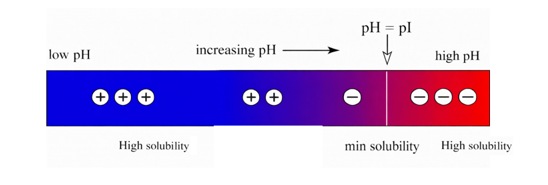

Protein solubility is an important functional property in food systems, influencing texture, stability, emulsification, and foaming behavior. It is affected by several factors such as pH, temperature, ionic strength, and the intrinsic structure of the protein. Among these, pH plays a dominant role in determining protein solubility. 
Proteins are amphoteric molecules containing both acidic (–COOH) and basic (–NH₂) groups. Depending on the pH of the surrounding medium, proteins can carry a positive charge, negative charge, or no net charge. 
At a specific pH known as the isoelectric point (pI): 
•	The number of positive and negative charges on the protein are equal. 
•	Net charge becomes zero. 
•	Electrostatic repulsion between molecules is minimized. 
•	Protein molecules aggregate and precipitate. 
•	Solubility is at its minimum. 
At pH values below or above the pI, proteins carry a net charge (positive or negative), leading to electrostatic repulsion between molecules. This prevents aggregation and increases solubility. 

 

Protein solubility is determined by measuring the amount of protein remaining in the supernatant after removal of the precipitated fraction. Comparing this value with the total protein initially added allows calculation of percentage solubility. 
This experiment demonstrates the relationship between pH and protein solubility, highlighting the concept of the isoelectric point and its practical significance in food formulation and processing.

<!--Moisture content in foods plays a critical role in determining their stability, shelf life, and Protein solubility is influenced by various factors, including pH, temperature, ionic strength, and the specific characteristics of the protein itself. The experiment focuses on how pH affects the solubility of a protein powder. At a certain pH, proteins tend to have minimal solubility, known as the isoelectric point (pI), where the protein carries no net charge and thus aggregates or precipitates. At pH values away from the pI, proteins are more soluble due to their charged nature, which prevents aggregation. The solubility can be measured by separating the insoluble fraction and comparing it with the total protein initially dissolved.
